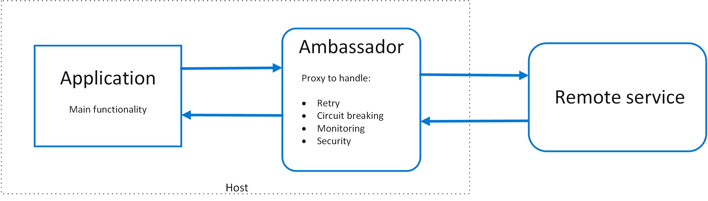

= Ambassador Pattern
 <Bhuwan P. Upadhyay>
v1.0, 2018-38-01

Create helper services that send network requests on behalf of a consumer service
or application. An ambassador service can be thought of as an out-of-process proxy
that is co-located with the client.

This pattern can be useful for offloading common client connectivity tasks such as monitoring,
logging, routing, security (such as TLS), and resiliency patterns in a language agnostic way.

==== Solution

==== Example
image::images/ambassador-example.png[]

====== REFERENCES:
1. https://docs.microsoft.com/en-us/azure/architecture/patterns/ambassador

